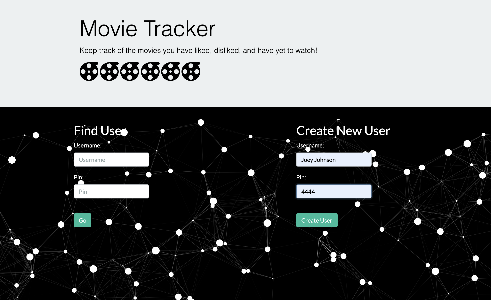
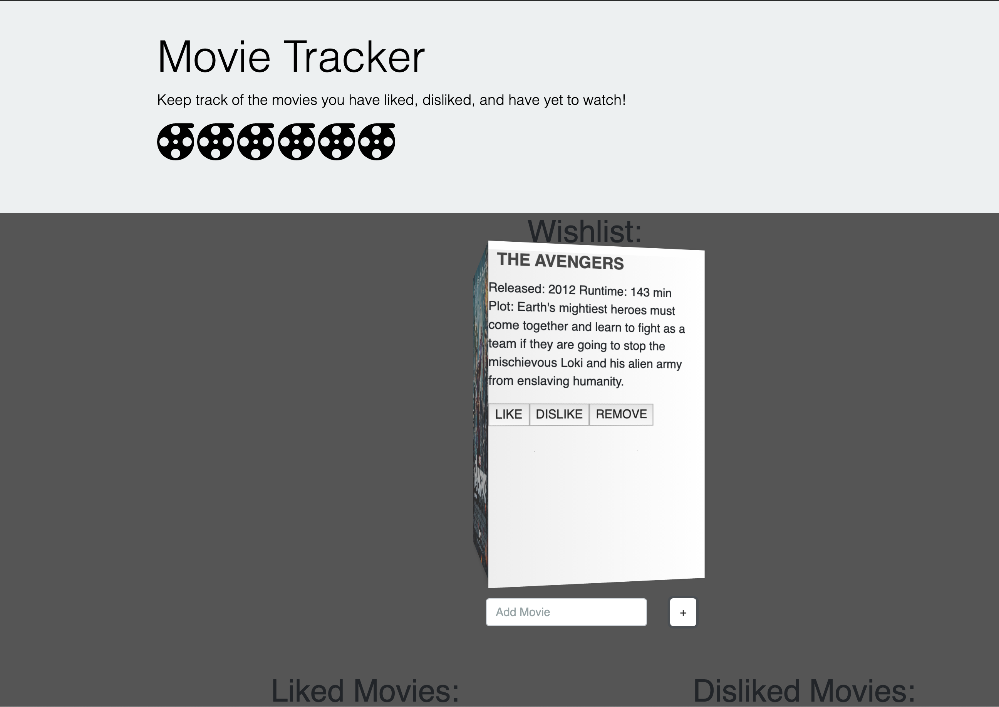
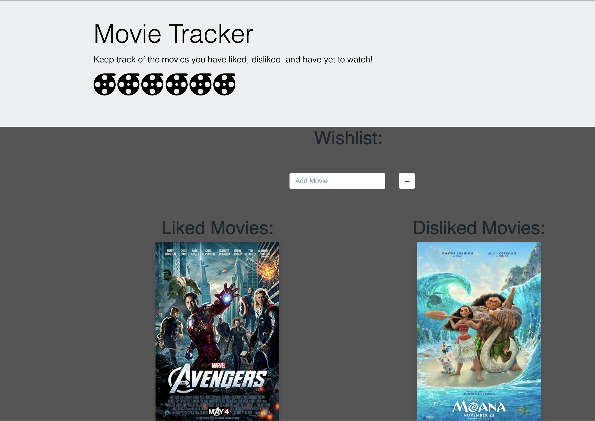
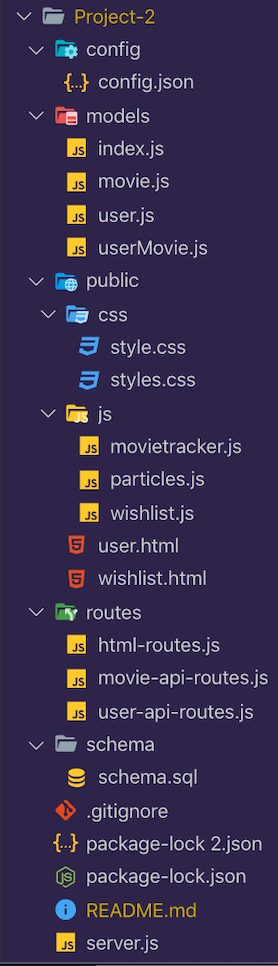

# Movie Tracker
An application built with Node, Express Servers,and MySQL

## App Screen-Shots:





## Link to full app demo on Heroku:
https://project-two-mock.herokuapp.com/

## About the project:

Movie Tracker is a an app that offers users, who are avid movie consumers, a handy way to manage all the movies they have seen or movies that they wawnt to see.


## User Guide:

1. New users, enter a username in the Create New User form.
   
   a. Enter a 4 or 5 digit user pin, which will be used to identify all your specific movies.

   b. Re-enter your usename and userpin in the Find User form and you will be taken to your Wishlist management page.

2. Current users, enter your username and userpin in the Find User form to be taken to your Wishlist management page.
   
3. On your Wishlist page, search for a movie in the Add Movie box.
   
4. When the movie is retreived, mouseover the 3D poster to see the Like, Dislike and Remove buttons.
   
5. Select one and the movie will be appended to a likes list or a dislikes list.
   
6. Returning users can access their wishlist to see a list of all the movies they have liked or disliked.


## MVP Objectives:

1. To have an app that allowed users to create a personal wishlist page through a username and unserpin. 
   
2. The userpin serves as the unique identifier distinguishing each user. 
   
3. Movies retreived by the user would be paired to each user through their userpin.

4. Each movie retrieved by the user would be stored in MySQL's database so that when a current user goes back to their wishlist page, They would be able to see the movies they queried in previous visits.

5. Leverage Sequelize's ORM to create the tables and drop the database in MySQL.

6. Appending users' movies to their Wishlist.

## Stretch Goals:

1. The full functionality of Like, Dislike and Remove buttons with the Like and Dislike buttons appending the movies selected by the users into separated lists.

2. Calling the OMDB API for the users' movies from the Add Movie input form and retreiving back a poster of the movie.

3. Animating the movie posters retreived back from OMDB.

  
## Techology Stack:
  * HTML
  * CSS
  * BootStrap
  * JavaScript
  * jQuery
  * Node.js
  * npm express
  * npm body-parser
  * npm path
  * MySQL
  * Sequelize
  * Heroku
  * OMDB API
  * animate.CSS
  * particles.js 
  * Iconify

## Methodology:

We created three, model tables for the database. One model table for the user; another model table for the movies that that each user inputs and a user-movie table that serves as the bridge linking the users with their movies. Using Sequelize's association methods, we linked each movie with "Movie.belongsToMany" users in the userMovie table. The code snippet is referenced below for further details.


## Problems We Overcame:

With Particles, the intial load just emptied the div and replaced it with the canvas element. To overcome this, css styling needed to set the particles.js div elements as the background. Code snippet is below.


## Problems Still Facing:

OMDB ajax calls sometimes takes too long and it takes a while load the movie poster. However, they will always load if you refresh the app. We think it's the OMDB API as opposed to the actual function calling the movies.


## Code Snippets:

For linking each user to the movies they entered into the database.
```
  Movie.associate = function(models) {

    Movie.belongsToMany(models.User, {
      through: {
        model: models.userMovie
      }
    });
  };
```
The root route that displays the user.html page when the application loads
```
  app.get("/", function(req, res) {
    res.sendFile(path.join(__dirname, "../public/user.html"));
  });

```
This movie API route deletes the user movie when the user clicks the delete button.
```
    app.delete("/wishlist/:userid/:movieid", function(req, res) {
      db.userMovie.destroy({
        where: {
          UserId: req.params.userid,
          MovieId: req.params.movieid
        }
      }).then(function(dbuserMovie) {
        res.json(dbuserMovie);
      });
    });
```
The is the ajax call to the delete API route.
```

  $(document).on("click", ".delete", deleteMovie)

  function deleteMovie() {
    console.log(this)
    var listUserId = $(this).data("userid");
    console.log(listUserId);
    var listMovieId = $(this).data("movieid");
    console.log(listMovieId);
    $.ajax({
        method: "DELETE",
        url: "/wishlist/" + listUserId + "/" + listMovieId
      })
      .then(getUserMovies);
  }
```
Placing particles.js dynamic animation as the background in the main user.html.
```
#particles-js {
  position: absolute;
  padding-top: 30px;
  width: 100%;
  height: 100%;
  background-image: url("");
  background-repeat: no-repeat;
  background-size: cover;
  background-position: 50% 50%;
  background: black;
}
```

## File Structure Screen-Shot:



## Team Members:
  1. Jordan Hagood
  2. Andrew Duong
  3. Oliver Sun

## Link to team members' portfolio pages on Github where this app is listed in the portfolio section.

https://github.com/hagoodj,  

https://hagoodj.github.io/responsive-portfolio/index.html

https://github.com/duongsters

https://github.com/Olisun?tab=repositories

https://olisun.github.io/Updated-Portfolio-Page/

## You can also reach us individually on LinkedIn.

https://www.linkedin.com/in/jordan-hagood-7b306410b/

https://www.linkedin.com/in/theandrewduong/

https://www.linkedin.com/in/oliver-sun-4b6baba/

